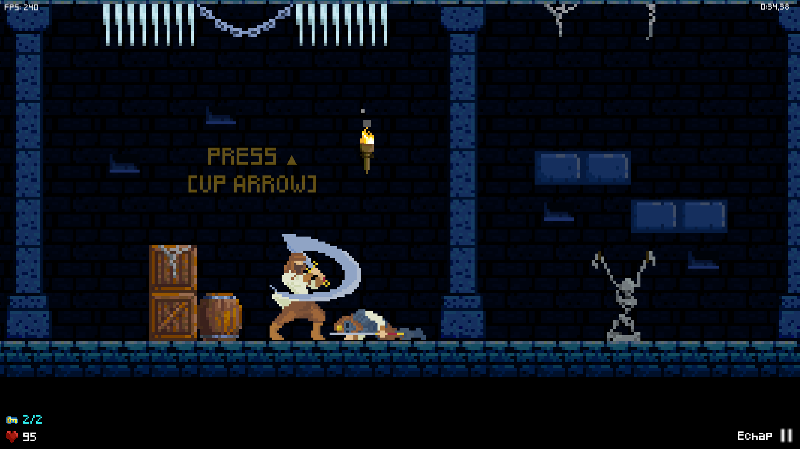

# TombRunner

.png>)



| **Game Programming** |
| :------------------: |
|    Julien QUENTIN    |

:musical\_note:Music: [Silent Footsteps · Skyrim Soundtrack](https://youtu.be/oPrwg4my5sI)



_Everything, exept for graphics (asset packs)_



.png>)

.png>)

.png>)





#### ​[​​](https://github.com/jqntn/jqntn/raw/main/TombRunner.zip) [Direct Download](https://github.com/jqntn/jqntn/raw/main/TombRunner.zip) (Recommended) 



#### Details 

* **Published:** June 2020
* **Duration:** Throughout the year
* **Genre:** 2D/Singleplayer/Platformer
* **Locales:** en-US
* **Engine:** Unity

#### Platforms 

#### Source 



